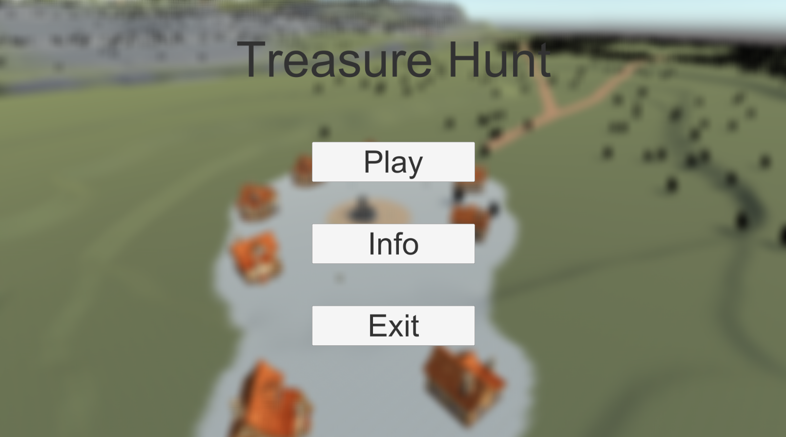
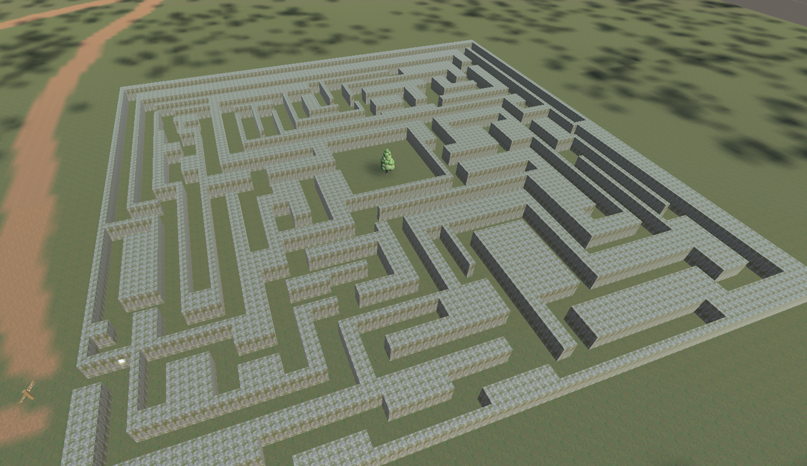
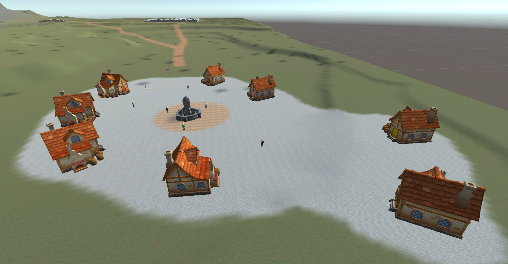
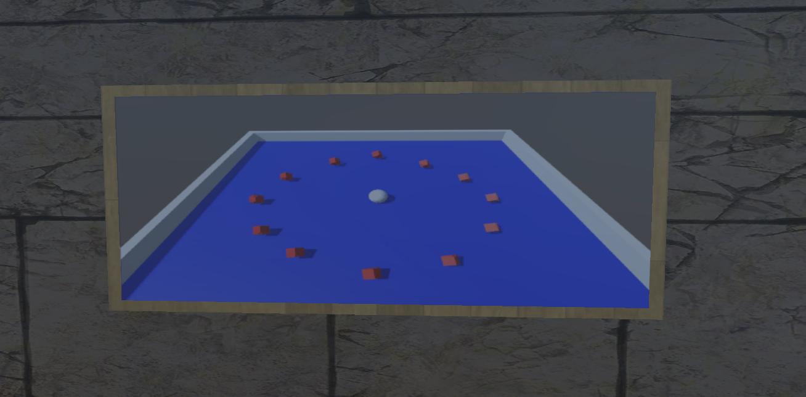
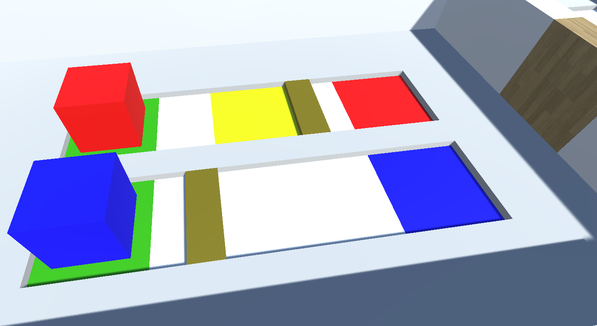
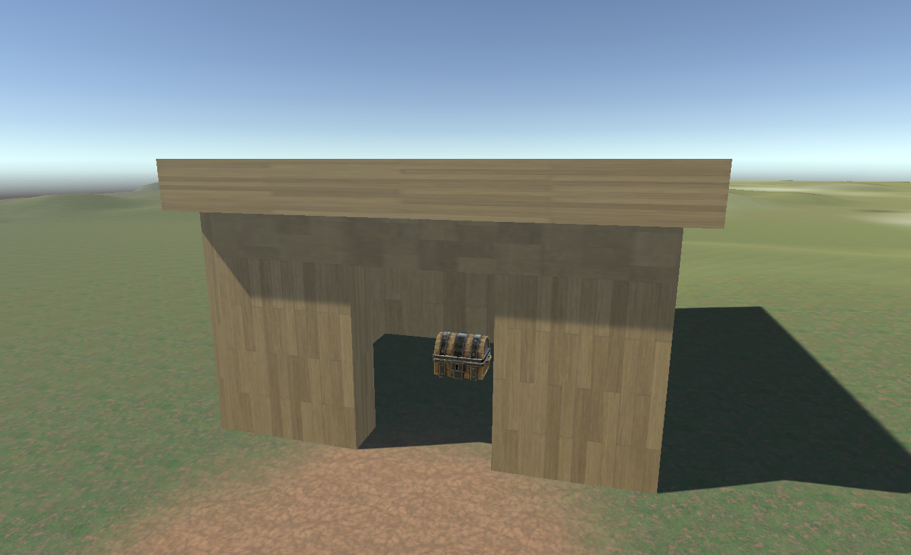

# Treasure Hunt
This is the first video game project in which I participated.

This is an adventure / puzzle game where the goal is to find 5 envelopes that each contain a letter that forms a word to open the final chest.

You are in a sort of open world at the bottom of a mountain.

## Context

Developped in a special week "Summer University" during my Bachelor.

Developped with Unity in C# during 1 week.

Team : 
 - Miguel Mendes
 - Christophe Fracheboud

## Game
The **first** envelope is given immediatly to the player and tells him what to do. Like the controls and what is his goal.

The **second** is given when the player leaves the first area : a **labyrinth**

At the exit of the latter, we enter an "open world" with 4 possible destinations : `Village`, `Mountain`, `Castle` ou `End House`. The first three are other challenges while the last is where the end of the game append.

One of the possible continuations is thus the village.

When we arrive at the village, there is a person on the ground who needs help to find his house. In order to find the right house, you have to talk to the other inhabitants, but they will answer with "I live next to Eric but not in the house with the brown door" or "I live far from Alex's house". The goal is to find the right house using this clues. At the end we get an envelope. 

Then come the other 2 zones `Mountain` et `Castle`. To get there, you have to go up the mountain.

The game of the `Mountain` is the next one :

This is a mini-game where the goal is to roll over all the red cubes using the white ball.

In the last zone `Castle`, you will find the last game to win an envelope.

In this last game, your goal is to put the colored cubes on the ground of the same color.

There are 5 levels which increase in difficulty (and size for the last two). They are formed in which way you learn the basics before having a real challenge.

## End game

Once the 5 envelopes in hands, we can move towards the final zone.

This is a small house in which you'll find a chest. In order to open it, you have to use the 5 envelopes ; each contain a letter, which assembled in the correct order forms a word. This word allows you to unlock the chest and access the end credits.